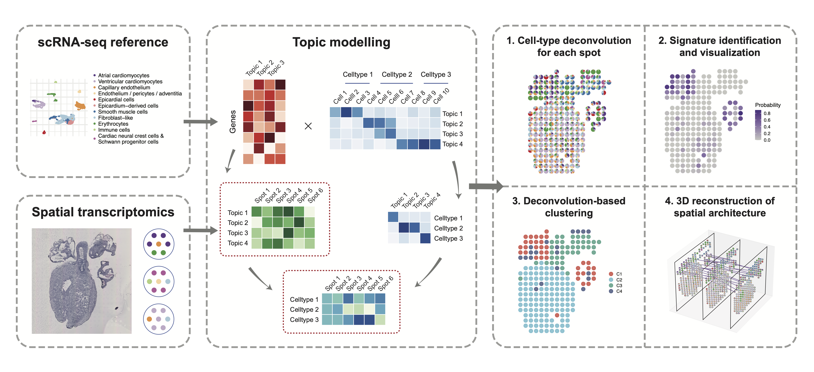

.. STRIDE documentation master file, created by
   sphinx-quickstart on Tue Aug  3 19:13:29 2021.
   You can adapt this file completely to your liking, but it should at least
   contain the root `toctree` directive.

Welcome to STRIDE's documentation!
==================================

.. toctree::
   :maxdepth: 2
   :caption: Contents:

|PyPI| |PyPIDownloads| |Docs|

.. |PyPI| image:: https://img.shields.io/pypi/v/stridespatial
   :target: https://pypi.org/project/stridespatial
.. |PyPIDownloads| image:: https://pepy.tech/badge/stridespatial
.. |Docs| image:: https://readthedocs.org/projects/stridespatial/badge/?version=latest
   :target: https://stridespatial.readthedocs.io

Spatial TRanscrIptomics DEconvolution by topic modeling (**STRIDE**), is a computational method to decompose cell types from spatial mixtures by leveraging topic profiles trained from single-cell transcriptomics. Besides the cell-type composition deconvolution, STRIDE also provides several downstream analysis functions, including (1) signature (i.e., topic) detection and visualization, (2) spatial clustering and domain identification based on neighborhood cell populations and (3) reconstruction of three-dimensional architecture from sequential ST slides of the same tissue. 

.. include:: release_notes/0.0.1.rst

.. toctree::
   :maxdepth: 1
   :hidden:

   installation
   tutorials
   release_notes/index
