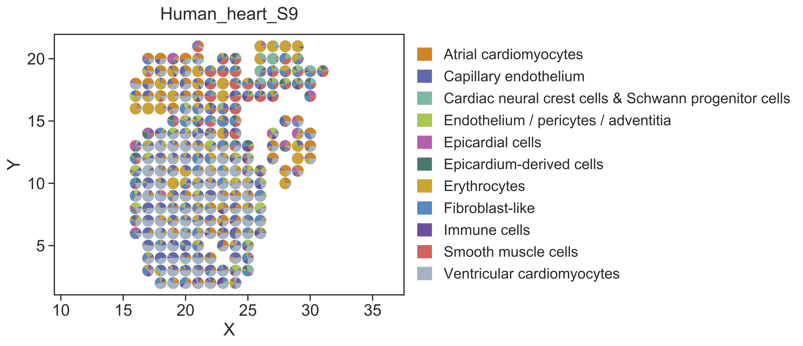
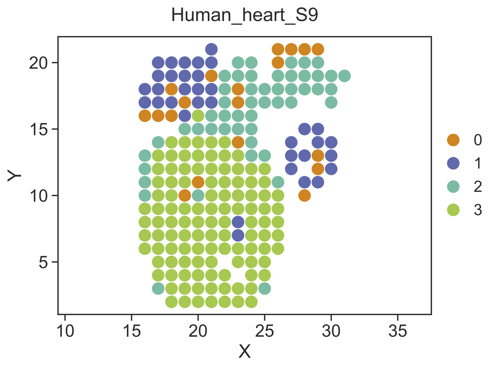
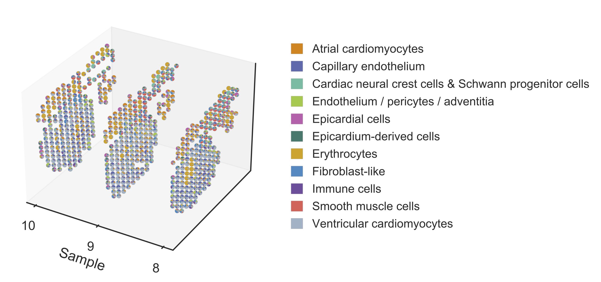

.. highlight:: shell

.. role:: bash(code)
   :language: bash

Developing human heart data
---------------------------

Here we use a developing human heart dataset (`Ji et al., Cell, 2020 <https://www.sciencedirect.com/science/article/pii/S0092867420306723>`_) to demonstrate the advanced usage of STRIDE. The original study provided 4, 9 and 6 heart sections from three timepoints, 4.5-6, 6.5, and 9 PCW, respectively, which were profiled by ST technology. They also provided a single-cell transcriptional profile of the 6.5 PCW tissue sample, generated through 10X Genomics Chromium platform. Users can download the processed data from `here <https://github.com/DongqingSun96/STRIDE/tree/main/test>`_.

Step 1 Deconvolve the cell-type composition of ST data
>>>>>>>>>>>>>>>>>>>>>>>>>>>>>>>>>>>>>>>>>>>>>>>>>>>>>>

Here we use the 6.5 PCW scRNA-seq data as a reference to deconvolve ST data of different timepoints. In this example, the scRNA-seq and the merged ST count matrices are stored in 10X `HDF5` format. We also provide a custom marker gene list for STRIDE to achieve a better performance in distinguishing similar cell types. With all data prepared, we use :bash:`STRIDE deconvolve` to dicpher the cell-type compositions of ST data.
::

   STRIDE deconvolve --sc-count Data/Human_heart_scRNA_gene_count.h5 \
   --sc-celltype Data/Human_heart_scRNA_celltype_curated.txt \
   --gene-use Data/Human_heart_scRNA_markers.txt \
   --st-count Data/Human_heart_ST_gene_count.h5 \
   --outdir Result/STRIDE --outprefix Human_heart --normalize

Step 2 Visualize the deconvolution result
>>>>>>>>>>>>>>>>>>>>>>>>>>>>>>>>>>>>>>>>>

After cell type deconvolution, :bash:`STRIDE plot` could be used to visualize the deconvolution result. Users can specify the sample of interest by setting :bash:`--sample-id`. Here we use sample 9 as an example.

::

   STRIDE plot --deconv-file Result/STRIDE/Human_heart_spot_celltype_frac.txt \
   --st-loc Data/Human_heart_ST_location.txt --sample-id 9 \
   --plot-type scatterpie --pt-size 12 \
   --outdir Result/STRIDE --outprefix Human_heart_S9

Step 3 Identify spatial domains
>>>>>>>>>>>>>>>>>>>>>>>>>>>>>>>

STRIDE could further identify the spatial domains by combining both the neighborhood information and the cell-type deconvolution result. Locations with similar cell-type compositions and similar surrounding cell populations will be clustered together. Also, users should specify the sample which they want to perform spatial clustering on.

::

   STRIDE cluster --deconv-file Result/STRIDE/Human_heart_spot_celltype_frac.txt \
   --st-loc Data/Human_heart_ST_location.txt --sample-id 9 \
   --plot --pt-size 11 \
   --weight 0.5 --ncluster 4 \
   --outdir Result/STRIDE --outprefix Human_heart_S9

Step 4 Reconstruct the three-dimensional model of the human heart by slide integration
>>>>>>>>>>>>>>>>>>>>>>>>>>>>>>>>>>>>>>>>>>>>>>>>>>>>>>>>>>>>>>>>>>>>>>>>>>>>>>>>>>>>>>

The original study provided multiple sequential slides at each timepoint, which we could use to reconstruct the three-dimensional model of the human heart. Here we take three sections from the 6.5 PCW heart, sample 8, 9, and 10, as an example to show the usage.

::

   STRIDE integrate --deconv-file Result/STRIDE/Human_heart_spot_celltype_frac.txt \
   --sample-id 8 9 10 --topic-file Result/STRIDE/Human_heart_topic_spot_mat_26.txt \
   --st-loc Data/Human_heart_ST_location.txt \
   --plot --pt-size 4.5 \
   --outdir Result/STRIDE --outprefix Human_heart_6.5PCW

