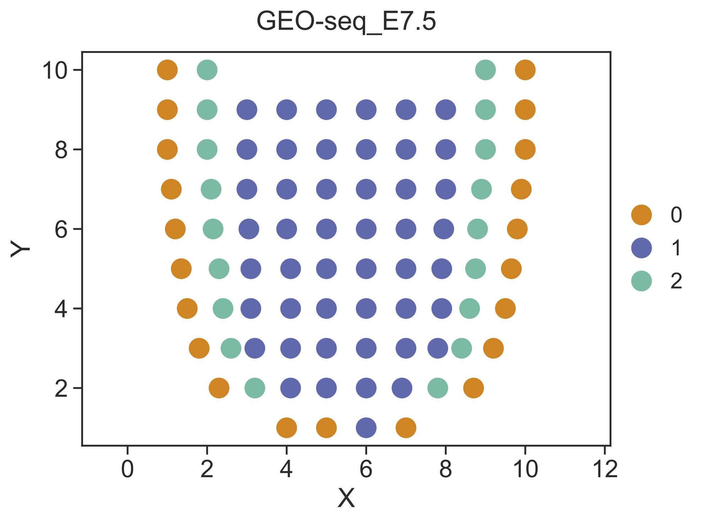

.. highlight:: shell

.. role:: bash(code)
   :language: bash

Mouse embryo GEO-seq data
-------------------------

Here we use a small GEO-seq dataset to demonstrate the simple usage of STRIDE. The GEO-seq data was derived from the study of early mouse embryo (`Peng et al., Nature, 2019 <https://www.nature.com/articles/s41586-019-1469-8>`_), and the scRNA-seq data was collected from another multi-omics study (`Argelaguet et al., Nature, 2019 <https://www.nature.com/articles/s41586-019-1825-8>`_). Only data of E7.5 are used in this example. Users can download the demo data from `here <https://github.com/DongqingSun96/STRIDE/tree/main/test>`_.

Step 1 Deconvolve the cell-type composition of GEO-seq data
>>>>>>>>>>>>>>>>>>>>>>>>>>>>>>>>>>>>>>>>>>>>>>>>>>>>>>>>>>>

The first step of STRIDE is to infer the cell-type-associated topic profiles from scRNA-seq. Next, the pre-trained topic model could be employed to infer the topic distributions of each spot in spatial transcriptomics. Finally, STRIDE could estimate the cell-type fractions of each spot by combining cell-type-by-topic distribution and topic-by-spot distribution. All these steps are implemented by :bash:`STRIDE deconvolve` function.
::

   STRIDE deconvolve --sc-count Data/scRNA_E7.5_gene_count.txt \
   --sc-celltype Data/scRNA_E7.5_lineage.txt \
   --st-count Data/GEO-seq_E7.5_gene_count.txt \
   --outdir Result/STRIDE --outprefix GEO-seq_E7.5 --normalize

The results of :bash:`STRIDE deconvolve` will be stored in the :bash:`Result/STRIDE` floder, and the detailed descritions are shown as below.

+---------------------------------------------------+---------------------------------------------------------------------------+
| File                                              | Description                                                               |
+===================================================+===========================================================================+
| model/                                            | The directory stores topic models trained using the scRNA-seq data.       |
+---------------------------------------------------+---------------------------------------------------------------------------+
| Model_accuracy_plot.pdf                           | The accuracy of cell-type assignment of single cells in scRNA-seq data,   |
|                                                   | which is used to select the optimal topic number.                         |
+---------------------------------------------------+---------------------------------------------------------------------------+
| Prediction_truth_heatmap_BayesNorm_{topicnum}.pdf | The confusion matrix for the selected topic model, which reflects the     |
|                                                   | consistency between the prediction and the truth for the scRNA-seq data.  |
+---------------------------------------------------+---------------------------------------------------------------------------+
| {outprefix}_spot_celltype_frac.txt                | The deconvolved cell-type fractions for all spots.                        |
+---------------------------------------------------+---------------------------------------------------------------------------+
| {outprefix}_topic_spot_mat_{topicnum}.txt         | The topic distribution for all spots. The 'topicmun' is the optimal topic |
|                                                   | number automatically selected by STRIDE.                                  |
+---------------------------------------------------+---------------------------------------------------------------------------+

Step 2 Visualize the deconvolution result
>>>>>>>>>>>>>>>>>>>>>>>>>>>>>>>>>>>>>>>>>

After cell type deconvolution, :bash:`STRIDE plot` could be used to visualize the deconvolution result. Users can choose either the :bash:`scatterpie` plot or the :bash:`scatter` plot by setting :bash:`--plot-type`.

::

   STRIDE plot --deconv-file Result/STRIDE/GEO-seq_E7.5_spot_celltype_frac.txt \
   --st-loc Data/GEO-seq_E7.5_location.txt --plot-type scatterpie --pt-size 13 \
   --outdir Result/STRIDE --outprefix GEO-seq_E7.5

.. image:: ../_static/img/GEO-seq_E7.5_deconv_scatterpie_plot.png
   :height: 350px
   :align: center

Step 3 Identify spatial domains
>>>>>>>>>>>>>>>>>>>>>>>>>>>>>>>

STRIDE could further identify the spatial domains by combining both the neighborhood information and the cell-type deconvolution result. Locations with similar cell-type compositions and similar surrounding cell populations will be clustered together.

::

   STRIDE cluster --deconv-file Result/STRIDE/GEO-seq_E7.5_spot_celltype_frac.txt \
   --st-loc Data/GEO-seq_E7.5_location.txt --plot --pt-size 13 \
   --weight 0.5 --ncluster 3 \
   --outdir Result/STRIDE --outprefix GEO-seq_E7.5

